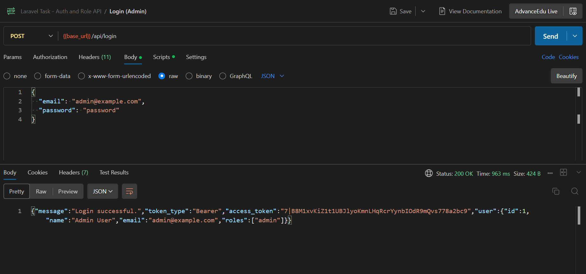
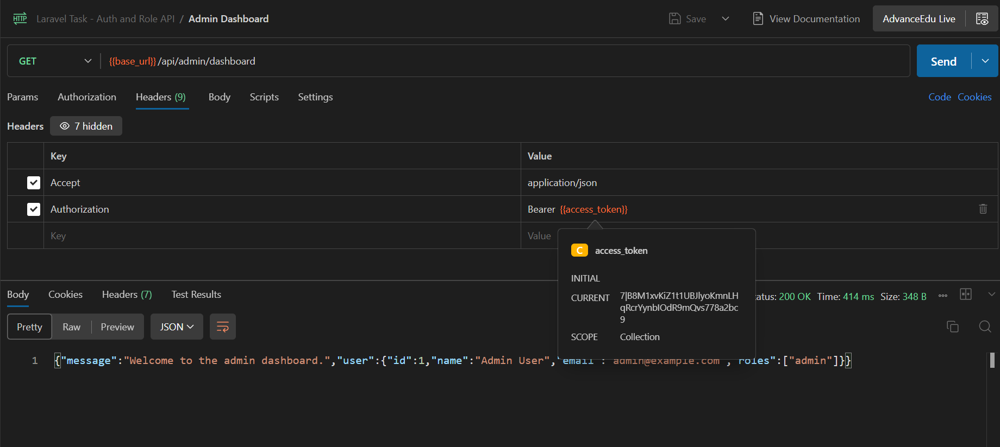
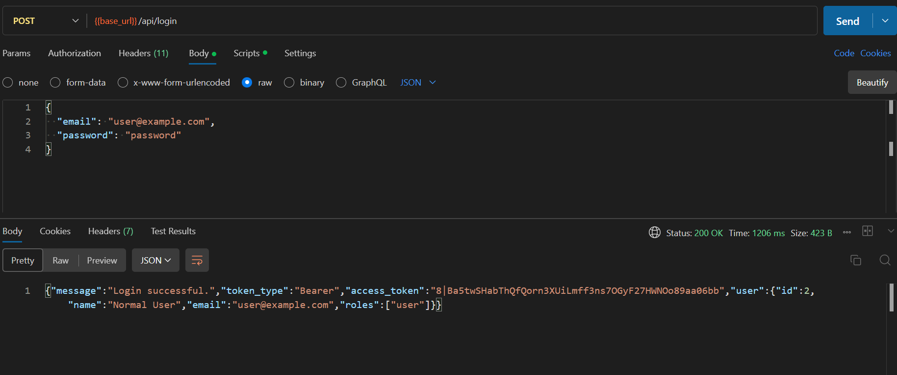
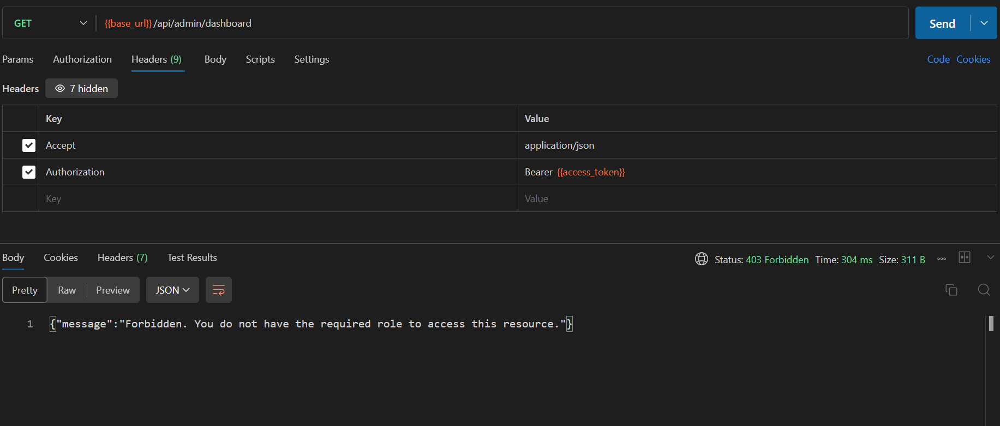
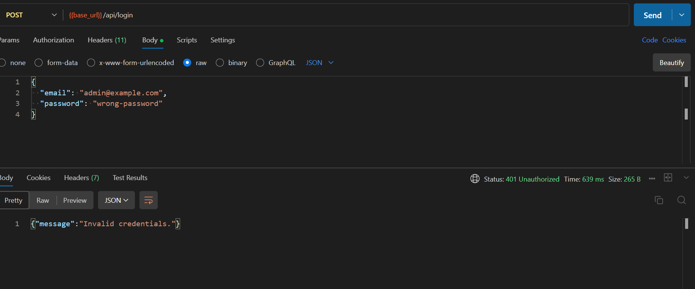

# Laravel Auth & Role-Based API

A small Laravel 11 REST API demonstrating token authentication with **Laravel Sanctum**
and role-based access control with **Spatie Laravel Permission**.

It exposes:

- `POST /api/login` — authenticate with email & password, receive an API token.
- `GET /api/admin/dashboard` — protected endpoint accessible **only** to users with the `admin` role.

## Tech Stack

- Laravel 11
- Laravel Sanctum (API token authentication)
- Spatie Laravel Permission (roles & permissions)
- MySQL / MariaDB

## Requirements

- PHP >= 8.2
- Composer
- MySQL or MariaDB (e.g. via XAMPP)

## Installation

```bash
# 1. Clone the repository
git clone <your-repo-url>
cd Laravel_Task

# 2. Install dependencies
composer install

# 3. Create your environment file
cp .env.example .env
php artisan key:generate
```

Then configure the database section of `.env` (defaults shown):

```env
DB_CONNECTION=mysql
DB_HOST=127.0.0.1
DB_PORT=3306
DB_DATABASE=laravel_task
DB_USERNAME=root
DB_PASSWORD=
DB_CHARSET=utf8mb4
DB_COLLATION=utf8mb4_unicode_ci
```

> **Note:** `DB_COLLATION` is set to `utf8mb4_unicode_ci` for compatibility with MariaDB
> (XAMPP), which does not support Laravel 11's default `utf8mb4_0900_ai_ci`.

Create the database (or do it via phpMyAdmin):

```sql
CREATE DATABASE laravel_task CHARACTER SET utf8mb4 COLLATE utf8mb4_unicode_ci;
```

Run migrations and seed the roles and demo users:

```bash
php artisan migrate --seed
```

Start the development server:

```bash
php artisan serve
```

The API is now available at `http://127.0.0.1:8000`.

## Seeded Accounts

The seeder creates two roles (`admin`, `user`) and two demo users:

| Role  | Email               | Password   |
| ----- | ------------------- | ---------- |
| admin | `admin@example.com` | `password` |
| user  | `user@example.com`  | `password` |

## API Endpoints

### 1. Login

`POST /api/login`

**Headers**

```
Accept: application/json
Content-Type: application/json
```

**Body**

```json
{
  "email": "admin@example.com",
  "password": "password"
}
```

**Success — `200 OK`**

```json
{
  "message": "Login successful.",
  "token_type": "Bearer",
  "access_token": "1|xxxxxxxxxxxxxxxxxxxxxxxx",
  "user": {
    "id": 1,
    "name": "Admin User",
    "email": "admin@example.com",
    "roles": ["admin"]
  }
}
```

**Invalid credentials — `401 Unauthorized`**

```json
{ "message": "Invalid credentials." }
```

**Validation error — `422 Unprocessable Content`**

```json
{
  "message": "The password field is required.",
  "errors": { "password": ["The password field is required."] }
}
```

### 2. Admin Dashboard

`GET /api/admin/dashboard`

Protected by Sanctum authentication **and** the `admin` role.

**Headers**

```
Accept: application/json
Authorization: Bearer <access_token>
```

**Success (admin) — `200 OK`**

```json
{
  "message": "Welcome to the admin dashboard.",
  "user": {
    "id": 1,
    "name": "Admin User",
    "email": "admin@example.com",
    "roles": ["admin"]
  }
}
```

**Authenticated but not admin — `403 Forbidden`**

```json
{ "message": "Forbidden. You do not have the required role to access this resource." }
```

**No / invalid token — `401 Unauthorized`**

```json
{ "message": "Unauthenticated." }
```

## Testing with Postman

A ready-to-import Postman collection is included at
[`postman/Laravel_Task.postman_collection.json`](postman/Laravel_Task.postman_collection.json).

1. Import the collection into Postman.
2. Run **Login (Admin)** — the returned token is automatically saved to the
   `access_token` collection variable.
3. Run **Admin Dashboard** — it uses the saved token and should return `200`.
4. Run **Login (User)** then **Admin Dashboard** again to see the `403` response.

The collection uses a `base_url` variable defaulting to `http://127.0.0.1:8000`.

## Screenshots

### 1. Login as Admin — `200 OK`

Returns a Sanctum token and the user's `admin` role.



### 2. Admin Dashboard (admin token) — `200 OK`

Authenticated admin can access the protected endpoint.



### 3. Login as User — `200 OK`

A non-admin user logs in and receives the `user` role.



### 4. Admin Dashboard (user token) — `403 Forbidden`

A non-admin user is blocked from the admin endpoint.



### 5. Login with wrong password — `401 Unauthorized`

Invalid credentials are rejected.


